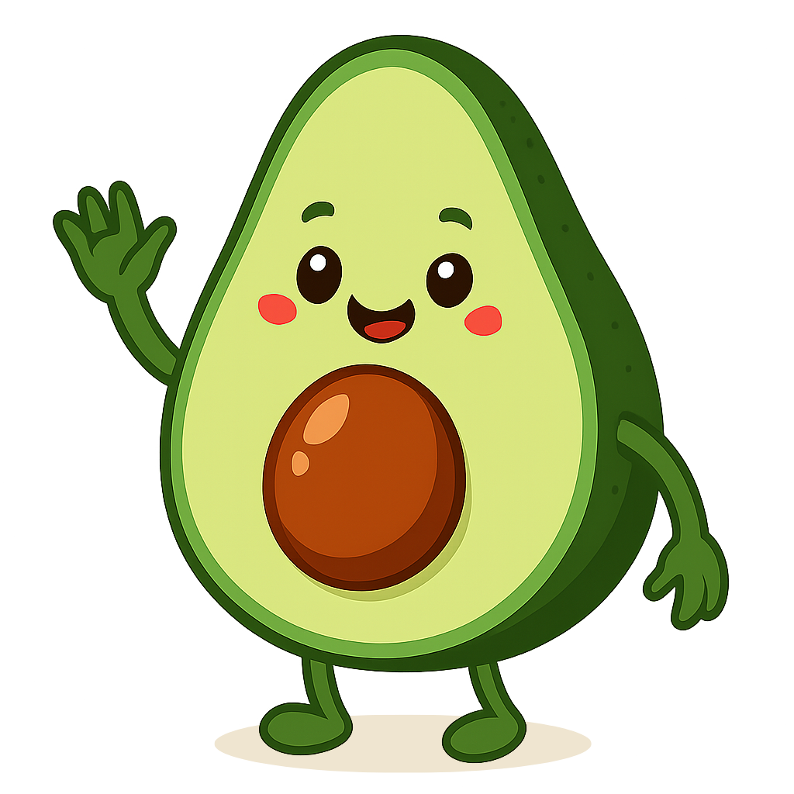

# 🥑 Avo AI Diet

<div align="center">
  
  
  <h3>AI-Powered Personal Diet Assistant</h3>
  
  <p>
    <strong>Meet Avo!</strong> Your personal diet guide and healthy lifestyle coach.
  </p>

  
  
  
  
  
  
  
  
</div>

---

## 📱 About the App

**Avo AI Diet** is a personalized diet and health application powered by Google Gemini AI technology. Start your healthy lifestyle journey with our lovely avocado character **Avo**!

### ✨ Key Features

🎯 **Personalized Diet Plans**
- Custom diet lists based on your physical characteristics
- Daily calorie tracking and goal setting
- Detailed nutrition recommendations

💬 **Smart Chat Assistant**
- Diet and health consultation
- Natural language processing for fluid conversations
- Personalized advice and tips

🎯 **Regional Fat Burning Guide**
- Interactive body mapping
- Region-specific exercise recommendations
- Targeted fat burning strategies

📊 **Progress Tracking**
- Visual calorie and goal tracking
- Daily nutrition analysis
- Motivational progress indicators

🔔 **Notifications**
- Personalized water intake reminders
- Random daily motivation notifications (12:00 - 21:00)

## 🚀 Technology Stack

### **Frontend**
- **Flutter** - Cross-platform mobile development
- **Dart** - Programming language
- **BLoC Pattern** - State management
- **Go Router** - Navigation management

### **Backend & AI**
- **Google Gemini AI** - Artificial intelligence and natural language processing
- **Firebase Core** - Backend infrastructure
- **Firebase Remote Config** - Remote configuration
- **Firebase Analytics** - Usage analytics

### **Data Storage**
- **Hive** - Local NoSQL database
- **Shared Preferences** - Simple data storage

### **UI/UX & Animations**
- **Lottie** - Vector animations
- **Percent Indicator** - Progress indicators
- **Flutter ScreenUtil** - Responsive design
- **Flutter SVG** - Vector graphics

### **Notifications & User Experience**
- **Flutter Local Notifications** - Smart notification system
- **Timezone** - Time-based notification scheduling

## 📸 Screenshots

<div align="center">
  


</div>

## 🛠️ Installation and Setup

### Prerequisites

- Flutter SDK (3.5.4 or higher)
- Dart SDK
- Android Studio / VS Code
- Firebase project

### Installation Steps

1. **Clone the repository**
   ```bash
   git clone https://github.com/mustafanarin/Avo-AI-Diet.git
   cd Avo-AI-Diet
   ```

2. **Install dependencies**
   ```bash
   flutter pub get
   ```

3. **Firebase configuration**
   - Create a new project in Firebase Console
   - Download `google-services.json` (Android) and `GoogleService-Info.plist` (iOS)
   - Android: Copy to `android/app/` folder
   - iOS: Copy to `ios/Runner/` folder

4. **Run code generation**
   ```bash
   flutter packages pub run build_runner build
   ```

5. **Run the application**
   ```bash
   flutter run
   ```

## 📁 Project Structure

```
lib/
├── feature/             # Feature modules
│   ├── chat/            # Chat functionality
│   │   ├── cubit/       # Chat state management
│   │   ├── state/       # Chat states
│   │   └── view/        # Chat UI components
│   ├── favorites/       # Favorites feature
│   ├── home/            # Home screen
│   ├── onboarding/      # User onboarding flow
│   ├── profile/         # User profile
│   ├── search/          # Search functionality
│   ├── splash/          # Splash screen
│   └── tabbar/          # Bottom navigation
├── product/             # Product-level configurations
│   ├── cache/           # Local data management
│   │   ├── manager/     # Cache managers
│   │   └── model/       # Cache models
│   ├── constants/       # App constants
│   │   └── enum/        # Enumerations and constants
│   │       ├── body_regions.dart
│   │       ├── project_colors.dart
│   │       ├── project_strings.dart
│   │       ├── prompt_repository.dart
│   │       └── water_notification_constants.dart
│   ├── routes/          # App routing
│   ├── theme/           # App theming
│   ├── utility/         # Utility functions
│   │   ├── exceptions/  # Custom exceptions
│   │   ├── extensions/  # Dart extensions
│   │   ├── init/        # Initialization logic
│   │   ├── mixin/       # Mixins
│   │   └── validator/   # Validation logic
│   └── widgets/         # Reusable UI components
│       ├── project_button.dart
│       ├── project_textfield.dart
│       └── project_toast_message.dart
├── services/            # Business services
│   ├── calori_calculator_service.dart
│   ├── gemini_service.dart
│   ├── notification_service.dart
│   └── rate_limit_service.dart
├── firebase_options.dart # Firebase configuration
└── main.dart            # Application entry point
```

## 🎨 Design System

### Color Palette
- **Primary Green**: `#557C55` - Main theme color
- **Secondary Green**: `#A6CF98` - Accent color
- **Background Cream**: `#FDF6F0` - Clean background
- **Text Color**: `#2C2C2C` - Readability
- **Dark Avocado**: `#2E5522` - Dark variations
- **Light Avocado**: `#9DC183` - Light variations
- **Accent Coral**: `#FF8966` - Highlighting elements

### Typography
- **Poppins** - Primary font family
- **Inter** - Secondary font family

## 🔧 Customization

### AI Prompts Management
The application uses a sophisticated prompt system for different AI interactions:

```dart
// lib/data/repositories/prompt_repository.dart
class PromptRepository implements IPromptRepository {
  // Diet planning prompts with calorie calculations
  String getDietPrompt(UserInfoModel user) { ... }
  
  // Chat assistant prompts with personality
  String getChatPrompt(String text, String conversationHistory, UserInfoCacheModel userInfo) { ... }
  
  // Regional fat burning advice prompts
  String getRegionalFatBurningPrompt(UserInfoCacheModel userInfo, List<String> selectedRegions) { ... }
}
```

## 🔒 Privacy and Security

- User's physical information is stored locally in cache using Hive
- No personal data is stored on servers
- Firebase App Check for API security

## 📱 Platform Support

| Platform | Status | Minimum Version |
|----------|--------|-----------------|
| Android  | ✅ Supported | API 21 (Android 5.0) |
| iOS      | ✅ Supported | iOS 12.0 |

## 🤝 Contributing

We welcome contributions! Please follow these steps:

1. Fork this repository
2. Create a feature branch (`git checkout -b feature/AmazingFeature`)
3. Commit your changes (`git commit -m 'Add some AmazingFeature'`)
4. Push to the branch (`git push origin feature/AmazingFeature`)
5. Create a Pull Request

## 🐛 Bug Reports

If you find a bug, please report it via [Issues](https://github.com/mustafanarin/Avo-AI-Diet/issues) page.

## 👨‍💻 Developer

**Mustafa Narin** - *Mobile Application Developer*

- Email: mustafa.narin1132@gmail.com
- LinkedIn: [Mustafa Narin](https://www.linkedin.com/in/mustafa-narin-167142258/)

---

<div align="center">
  <p>🥑 <strong>Healthy living starts with Avo!</strong> 🥑</p>
  
  
  
  ⭐ **Don't forget to star the project if you like it!** ⭐
</div>
